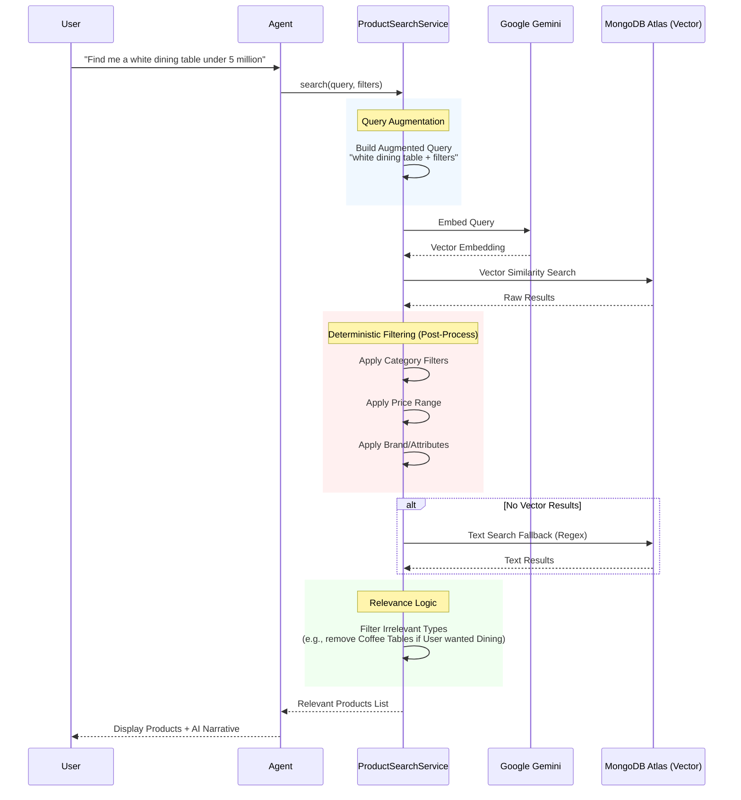

# System Architecture

This document describes the architecture of the AI Agent and RAG system.

## 1. Hybrid Agent Architecture (Current Production)

The current system uses a **Hybrid Agent** (`agent-hybrid.ts`) which combines deterministic logic with AI capabilities. This approach is chosen for reliability, speed, and deterministic state management.

```mermaid
flowchart TD
    User([User Message]) --> State[Get/Create Conversation State]
    State --> Intent[Intent Extraction<br/>(Small LLM / 4o-mini)]
    
    Intent --> CheckIntent{Special Intent?}
    
    CheckIntent -- Yes<br/>(Greeting, Help, FAQ) --> GenResponse[Response Generator<br/>(LLM / Llama-3)]
    
    CheckIntent -- No<br/>(Search) --> Reformulation{New Search vs Continuation}
    
    Reformulation -- New Search --> NewBase[Set New Base Query]
    Reformulation -- Continuation --> Reformulator[Query Reformulator<br/>(LLM)]
    
    NewBase --> VectorSearch
    Reformulator --> VectorSearch
    
    subgraph RAG [Product Search Service]
        VectorSearch[Vector Search + Filters]
    end
    
    VectorSearch --> GenResponse
    
    GenResponse --> Final[Final Response<br/>(Intro + Products + Follow-up)]
    
    style User fill:#f9f,stroke:#333
    style RAG fill:#e1f5fe,stroke:#01579b
    style GenResponse fill:#fff9c4,stroke:#fbc02d
```

### Key Components
- **Intent Extraction**: Classifies user intent (Search, FAQ, Greeting).
- **State Management**: Deterministic MongoDB storage of conversation context (filters, last query).
- **Query Reformulation**: Intelligent rewriting of follow-up queries (e.g., "how about red ones?" -> "red dining table").
- **Response Generator**: Generates natural language narratives but *does not* hallucinate products.

---

## 2. RAG (Retrieval-Augmented Generation) Architecture

The RAG system (`services/ProductSearch.ts`) is designed to be **deterministic** and prioritized for e-commerce accuracy.



### Key RAG Features
1.  **Hybrid Search**: Prioritizes Vector Search, falls back to Text Search.
2.  **Deterministic Filtering**: Filters are applied *strictly* (programmatically) after retrieval to ensure accuracy (e.g., price < 5,000,000 is mathematically enforced).
3.  **Relevance Guardrails**: Logic to prevent "semantic drift" (e.g., ensuring "dining table" doesn't return "coffee table" just because they are semantically similar).

---

## 3. Legacy LangGraph Architecture

This is the implementation based on the `LangGraph` library (`agent.ts`). It uses a graph-based ReAct (Reasoning + Acting) approach.

```mermaid
graph LR
    Start((Start)) --> Agent
    
    subgraph "Graph Workflow"
        Agent[Agent Node<br/>(LLM Decision)]
        Tools[Tool Node<br/>(item_lookup)]
        
        Agent -- "Calls Tool" --> Tools
        Tools -- "Returns Data" --> Agent
        Agent -- "Final Answer" --> End((End))
    end
    
    style Agent fill:#e1f5fe,stroke:#01579b
    style Tools fill:#ffe0b2,stroke:#f57c00
```
